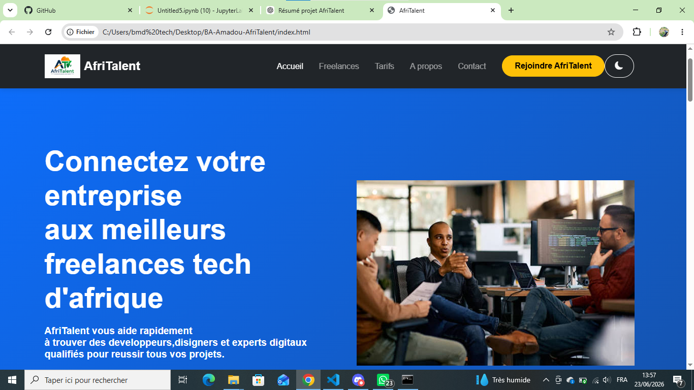
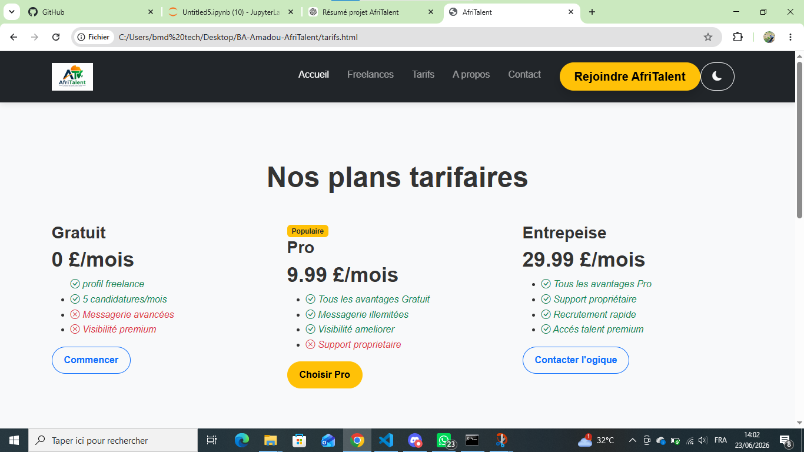
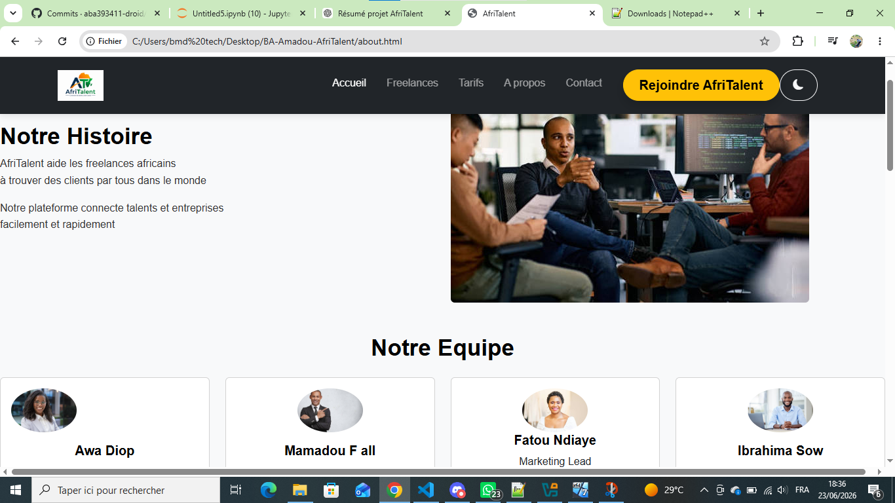

# AfriTalent

Projet académique réalisé dans le cadre du module Développement Web.

## Description

AfriTalent est une plateforme qui met en relation des freelances africains et des entreprises à la recherche de talents technologiques.

## Technologies utilisées

- HTML5
- CSS3
- Bootstrap 5
- JavaScript
- Git & GitHub

## Fonctionnalités

- Page d'accueil
- Liste des freelances
- Tarifs
- À propos
- Contact
- Dark mode
- Responsive design
- Filtrage dynamique des freelances
- Validation du formulaire
- Bouton retour en haut

## Capture d'écran

## Auteur

Ba Amadou